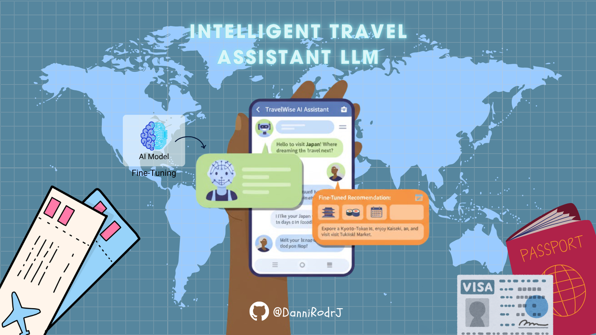

# ✈️ ```Intelligent Travel Assistant LLM: TinyLlama Fine-Tuning with LoRA```



This repository showcases a complete MLOps pipeline for adapting a Large Language Model (LLM) to a specialized domain: an intelligent travel assistant chatbot. The project utilizes Supervised Fine-Tuning (SFT) with Parameter-Efficient Fine-Tuning (PEFT) to achieve high-accuracy responses for travel queries.

## 🚀 ```LIVE DEMO```

|Modelo | Tipo | Enlace |
|--------|------|--------|
| **DialoGPT-medium** | Demo en vivo (rápida) | [Try it now!](https://tu-app.streamlit.app) |
| **TinyLlama-1.1B** | Demo completa (potente) | [Watch video](https://youtu.be/xxxx) |

## ⚙️ ```Project Overview and Core Technologies```

The goal was to transform the general-purpose TinyLlama-1.1B model into a domain-specific Q&A engine for airline customer service data.

### 🛠️ ```Key Technologies Demonstrated```

| Category   |      Tool / Technique      |  Purpose in Project |
|----------|-------------|------|
| **Model** |  TinyLlama-1.1B | Base LLM for causal language modeling |
| **Fine-Tuning** |    LoRA (PEFT)   |   Parameter-Efficient Fine-Tuning to train adapters efficiently on limited hardware (GPU/CPU) |
| **Pipeline** | TRL (SFTTrainer) |  High-level abstraction for SFT and efficient training loop management |
| **Data & Core** | ```Hugging Face``` Ecosystem (```transformers```, ```datasets```) |  Handling models, tokenizers, and dataset preparation |
| **Engineering** | Python Classes & Modularization |  Encapsulating training and inference logic (TravelAssistantPipeline) |
| **Deployment** | Streamlit |  Creating an interactive web demo for presentation |

## 🚀 ```MLOps Pipeline Structure```

The repository is structured following best practices for production-ready ML projects, separating configuration, data, source code, and artifacts.

```bash
tinyllama_fine_tuning/         
│
├── config/                   
│   └── config.py
│
├── data/
│   ├── prepocessed_dataset/                 
│   │   ├── data-00000-of-00001.arrow
│   │   ├── dataset_info.json
│   │   └── state.json     
│
├── models/
│   ├── tinyllama_travel_adapter/                 
│   │   ├── adapter_config.json
│   │   ├── adapter_model.safetensors
│   │   ├── added_tokens.json
│   │   ├── README.md
│   │   ├── special_tokens_map.json
│   │   ├── tokenizer_config.json
│   │   ├── tokenizer.json
│   │   └── tokenizer.model
│
├── notebooks/              
│   └── development.ipynb
│
├── src/                 
│   ├── utils/           
│   │   ├── logger.py
│   ├── data_preparation.py  # Functions for data loading, sampling, and formatting
│   └── pipeline.py  # Primary class for the ML workflow (Train, Load, Infer).
│
├── .gitignore
├── main.py
├── README.md
└── requirements.txt    
```

## 💡 ```Fine-Tuning Methodology```

1. **Data Preparation**

    The bitext/Bitext-travel-llm-chatbot-training-dataset was sampled using a balanced approach across intents to create a development dataset of 50 records. Each record was formatted into the standard conversational structure required for SFT:  
    ```"Query: [User Instruction]\nResponse: [Assistant Answer]"```
2. **Training (Supervised Fine-Tuning)**
   - **Technique**: LoRA was applied to target the attention projection layers (```q_proj```, ```v_proj```) of the base model.
   - **Process**: The training was executed using the SFTTrainer (with configurations managed by SFTConfig), resulting in a final training loss of approx. 0.91.
3. **Inference and Deployment**

    The TravelAssistantPipeline class manages the conditional flow:
    - It checks for existing adapter checkpoints in ```./models/```.
    - If found, it loads the base model and merges the LoRA adapters into a single, efficient model (model.merge_and_unload()) for inference.

## 💻 ```Setup and Execution```

### Prerequisites

1. Clone this repository
2. Install all dependencies (preferably in a virtual environment).
   ```pip install -r requirements.txt```
3. Download Checkpoints: Ensure the trained LoRA adapters (```adapter_model.safetensors```, etc.) are placed in the directory ```./models/tinyllama_travel_adapter/```

### ✅ MLOps Validation (CLI Mode)

Execute ```main.py``` to run the full pipeline logic, including the sanity check and logging.

```python main.py```

Expected Console Output (Proof of Success): The pipeline will detect the saved adapter and skip training, demonstrating the MLOps logic:

```bash
2025-11-07 12:34:xx - INFO - ✅ Checkpoint found: Loading adapters from ./models/tinyllama_travel_adapter
...
2025-11-07 12:34:xx - INFO - Base model and LoRA adapters merged.
...
✅ CLASS INFERENCE CYCLE COMPLETED ✅
Instruction: I'd like information about my checked baggage allowance, how can I find it?
Response Generated:
To find details regarding your checked baggage allowance, please follow these steps:
1. Visit {{WEBSITE_URL}} or access the {{APP_NAME}} application.
...
```

### 👀 Interactive Demo (Streamlit)

Launch the interactive web application for a demonstration.

```bash
streamlit run app.py
```

This command will open the specialized travel assistant interface in your browser.

## ⚠️ ```Important Note: Language Scope```

This LLM was fine-tuned exclusively using English Q&A data. While the base TinyLlama model has multilinguistic capabilities, the specialized instruction tuning was conducted only in English.

The model performs best on English queries and may generate inconsistent or incoherent responses when prompted in other languages.

## 📚 ```Project Context and Value Added```

This project originated as a **Supervised Fine-Tuning (SFT) Lab Challenge** on the [DataCamp platform](https://app.datacamp.com/learn/projects/2827)

**Value Added by this Repository:**

- **Modularization & MLOps:** The original monolithic notebook was refactored into a professional, modular Python package structure (`src/`, `config/`, `models/`).
- **Pipeline Logic:** Implemented conditional execution logic (`run_or_load`) to separate the intensive training phase (Colab/GPU) from the lightweight inference phase (local CPU).
- **Deployment Prototype:** Integrated a **Streamlit** application (`app.py`) to move the model from a simple console output to an interactive, deployable web demonstration.
- **Best Practices:** Enforced standardized logging (`logger.py`) and explicit configuration management (`config.py`).

## 👩‍💻 ```Developer```

If you would like to contact me, simply click on my name and you will be redirected to my LinkedIn profile. I would be delighted 🤗 to answer your questions and share more details about my skills and experience.

<div align="center">

*AI Engineer*
| [<br><sub>Danniela Rodríguez</sub>](https://www.linkedin.com/in/danniela-rodriguez-jove-/)
| :---: |

<div align="left">

## 🙌 ```Acknowledgements and Updates```

*Thank you for reviewing this project* 🤗! *If you would like to stay informed about future updates, please star the repository* ⭐. *You can find the option to do so at the top right of the page. Your support is greatly appreciated.*